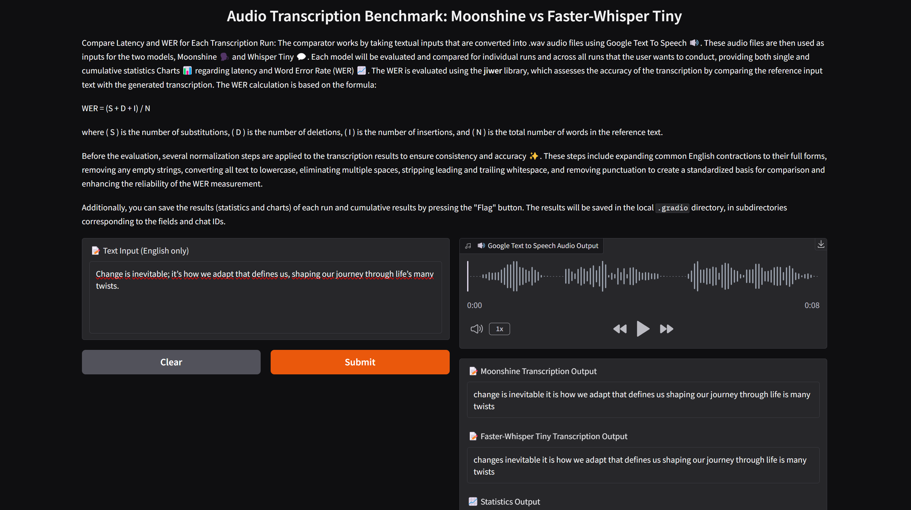
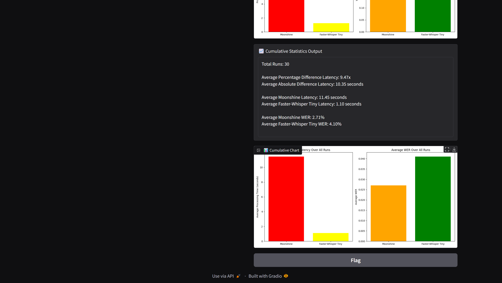

# 🎙️ Audio Transcription Comparison: Moonshine vs Faster-Whisper Tiny


This project compares the **Moonshine** and **Faster-Whisper Tiny** transcription models by analyzing **latency** and **Word Error Rate (WER)**. Users can input text, which is converted to audio and transcribed by both models. The results are presented through detailed statistics and visual outputs.

---

# 📦 Installation Instructions

### Installing uv
To install the uv library, run:

```
pip install uv
```
For more information, visit the [uv GitHub repository](https://github.com/astral-sh/uv)

### Installing Moonshine
The Moonshine inference code is developed using Keras and is compatible with all the backends that Keras supports: Torch, TensorFlow, and JAX. The backend you select will determine which version of the Moonshine package you should install. If you are just starting out, we recommend installing the default backend, which is Torch:

```
pip install useful-moonshine@git+https://github.com/usefulsensors/moonshine.git
```
To run the provided inference code, you have to instruct Keras to use the PyTorch backend by setting an environment variable:
```
export KERAS_BACKEND=torch
```

To run with the TensorFlow backend, install Moonshine and set the environment variable:
```
pip install useful-moonshine[tensorflow]@git+https://github.com/usefulsensors/moonshine.git
export KERAS_BACKEND=tensorflow
```
To run with the JAX backend, use:
```
pip install useful-moonshine[jax]@git+https://github.com/usefulsensors/moonshine.git
export KERAS_BACKEND=jax
```

To run with ONNX runtime, execute:
```
pip install useful-moonshine[onnx]@git+https://github.com/usefulsensors/moonshine.git
```
For detailed installation instructions, visit the [Moonshine GitHub repository](https://github.com/usefulsensors/moonshine/tree/main)

### Installing Faster-Whisper
For information on installing Faster-Whisper, visit the [Faster-Whisper GitHub](https://github.com/openai/whisper)

## 🌟 Features

- **Text-to-Speech Conversion 🔊**: Input text is transformed into audio using Google Text-to-Speech.
- **Model Comparison**: Evaluates each model's speed and accuracy over multiple runs.
- **Statistical Insights 📈**: Displays individual run statistics and cumulative averages.
- **Dynamic Visualizations 📊**: Interactive charts for latency and WER comparison.
- **WER Calculation**: WER is assessed using the **jiwer** library, which measures transcription accuracy against the original text.

## 📜 Getting Started

### Prerequisites

Ensure the following libraries are installed:

```
pip install gradio faster-whisper jiwer numpy matplotlib gtts pydub
```

or install them from the requirements.txt file:

```
pip install requirements.txt
```


### How to Run

1. Clone the repository and navigate to the project folder.
   ```bash
   git clone https://github.com/chrisputzu/comparison-moonshine-vs-faster-whisper-tiny-en.git
   ```

2. Open the Gradio Interface in your browser. Enter text, which will be converted to audio and transcribed by both models, with results displayed.

## 🧩 Workflow

1. **Text-to-Speech**: Input text is converted to .wav audio.
2. **Transcription**: Audio is transcribed by both Moonshine and Faster-Whisper Tiny.
3. **WER Calculation**: Accuracy is measured with WER, normalizing the text for consistency.
4. **Statistical Comparison**: Real-time charts update with each run, displaying cumulative averages.

## 🧮 WER Calculation

The Word Error Rate (WER) measures transcription accuracy as:

```
WER = (S + D + I)/N
```

where:

- \( S \): Number of substitutions
- \( D \): Number of deletions
- \( I \): Number of insertions
- \( N \): Total words in the reference text

### WER Normalization

Before calculating WER, the transcription undergoes normalization:

- Expanding common contractions
- Lowercasing text
- Removing punctuation, whitespace, and multiple spaces
---

## 🗂️ Saving Comparison Results

The results of the comparison between the **Moonshine** and **Faster-Whisper Tiny** models, including input/output texts and charts, can be saved locally in the `.gradio/flagged/` directory. The subdirectories will be named after the output fields and will include the following folders and files:

- 📊 **Chart**: Contains performance graphs.
- 📈 **Cumulative Chart**: Contains cumulative performance graphs.
- 🎤 **Google Test to Speech Audio Output**: Contains audio files generated by Google Text-to-Speech.
- 📅 **dataset1.csv**: A CSV file logging the chat timestamps and logs.

To save these results, simply press the **"Flag"** button in the Gradio interface! 🚩

## 📊 Results

The results of the test conducted with audio transcriptions generated from the text files `comparison-moonshine-vs-faster-whisper-tiny-en\test_data\test_texts.txt` based on 30 runs, are summarized below.

### Latency Comparison
- **Average Percentage Difference Latency:** 9.47x
- **Average Absolute Difference Latency:** 10.35 seconds
- **Average Moonshine Latency:** 11.45 seconds
- **Average Faster-Whisper Tiny Latency:** 1.10 seconds

### Word Error Rate (WER) Comparison
- **Average Moonshine WER:** 2.71%
- **Average Faster-Whisper Tiny WER:** 4.10%

The comparison shows that Faster-Whisper Tiny outperforms Moonshine in terms of latency, with an average processing time of only 1.10 seconds compared to Moonshine's 11.45 seconds. This results in an average percentage difference in latency of 9.47x, indicating that Faster-Whisper Tiny is significantly faster.

In terms of accuracy, Moonshine has a lower Word Error Rate (WER) of 2.71%, while Faster-Whisper Tiny has a WER of 4.10%. This suggests that although Faster-Whisper Tiny is faster, it sacrifices some transcription accuracy compared to Moonshine.





